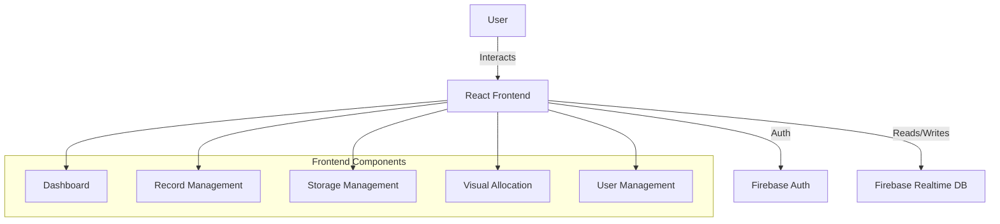
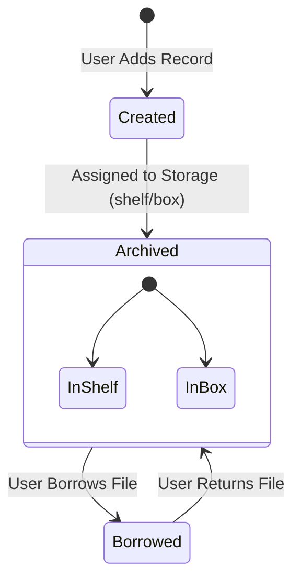

# ProcureFlow 2.0 - Procurement & Document Management System

## 🌟 Executive Summary

**ProcureFlow 2.0** is a modern, digital solution designed to solve the chaos of physical file management in procurement offices. It serves as a **"Digital Twin"** for your physical storage, allowing staff to track, locate, and manage procurement documents with the same ease as finding a file on a computer.

By bridging the gap between physical storage (Shelves, Cabinets, Boxes) and digital records, ProcureFlow ensures that **no document is ever lost**, and the status of every procurement project is visible in real-time.

---

## 🎯 Project Background & Problem Statement

### The Problem
Traditional procurement offices often struggle with:
-   **Lost Files**: Physical folders go missing when borrowed or misplaced.
-   **Lack of Visibility**: It's hard to know the status of a procurement project (e.g., "Is it still in bidding? Did we get the Notice to Proceed?") without digging through paper piles.
-   **Inefficient Retrieval**: Finding a specific document can take hours of searching through unorganized cabinets.
-   **No Accountability**: Difficult to track who borrowed a file and when it was returned.

### The Solution: ProcureFlow 2.0
ProcureFlow 2.0 addresses these issues by:
1.  **Digitizing Indexing**: Every physical folder and box has a digital record indicating exactly where it lives (e.g., *Cabinet A > Shelf 2 > Box 5*).
2.  **Tracking Lifecycle**: Monitors the entire journey of a procurement project, from "Regular Bidding" to "Archived".
3.  **Checklist Management**: Ensures all required documents (Notice of Award, Contracts, etc.) are present and accounted for.
4.  **Borrowing System**: Logs who borrowed a file and enforces a clear "Borrowed" vs. "Returned" status.

---

## 📖 User Guide & Key Features

### 1. Dashboard (`/`)
The **Mission Control** center.
-   **What you see**: Instant snapshot of the system's health.
-   **Key Metrics**: Total files, number of files currently borrowed, and storage space usage.
-   **Visual Charts**: colorful graphs showing the breakdown of procurement types and status.
-   **Quick Search**: A powerful search bar to find any project by PR Number or Title instantly.

### 2. Procurement Records (`/procurements`)
The **Digital Filing Cabinet**.
-   **List View**: See all procurement projects in a table.
-   **Search & Filter**: Find records by Date, Status (Ongoing/Completed), or Type (Bidding/SVP).
-   **Add New Record**: Create a new entry for a fresh procurement request.
-   **View/Edit**: Click any record to see its full details, update its status, or modify the document checklist.
-   **Export**: Download lists as CSV/Excel for reporting.

### 3. Visual Storage Map (`/visual-allocation`)
The **GPS for Files**.
-   **Interactive Map**: A visual representation of your physical office storage.
-   **Click-to-Find**: Click on a "Virtual Cabinet" to see exactly which files are inside it.
-   **Capacity Planning**: See which shelves are full and which have space for new boxes.

### 4. Admin & User Management
The **Security Gate**.
-   **Role-Based Access**:
    -   **Admins**: Can manage users, edit system settings, and delete records.
    -   **Staff**: Can view, add, and edit records but cannot delete critical data.

---

## 🚀 How It Works: A Simple Flow

1.  **Receive Request**: A new Purchase Request (PR) comes in.
2.  **Create Record**: Staff logs it into ProcureFlow (`/add-procurement`), checking off initial documents.
3.  **Process**: As the bidding happens, staff updates the **Checklist** (e.g., checking "Pre-Bid Conference" when done).
4.  **Archive**: Once the project is done, the physical folder is placed in a **Box** on a **Shelf**.
5.  **Assign Location**: In ProcureFlow, the record is updated to show its new home: "Shelf 1, Box 3".
6.  **Retrieval**: If an auditor needs the file, staff searches the PR Number, finds "Shelf 1, Box 3", and retrieves it instantly.

---
---

# 🛠️ For Developers: Technical Documentation

## 1. Technology Stack
-   **Frontend**: React (Vite), TypeScript
-   **Styling**: Tailwind CSS, Shadcn UI
-   **Database**: Firebase Realtime Database
-   **State Management**: React Hooks
-   **Charts**: Recharts

## 2. System Architecture



## 3. Data Flow: Procurement Lifecycle



## 4. Setup & Installation

1.  **Clone the repository**
    ```bash
    git clone <repository-url>
    ```

2.  **Install dependencies**
    ```bash
    npm install
    ```

3.  **Environment Setup**
    Create a `.env` file with your Firebase credentials:
    ```env
    VITE_FIREBASE_API_KEY=...
    VITE_FIREBASE_AUTH_DOMAIN=...
    VITE_FIREBASE_DATABASE_URL=...
    ```

4.  **Run Development Server**
    ```bash
    npm run dev
    ```

5.  **Build for Production**
    ```bash
    npm run build
    ```
